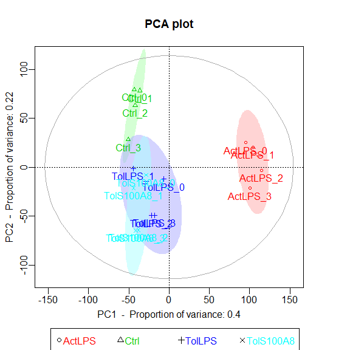

------------------------------------------------------------------------

<br>

The following workflow has been designed as teaching instructions for an introductory course to RNA-seq data analysis with DESeq2.

The course is designed for PhD students and will be given at the University of Münster from 10th to 21st of October 2016.

For questions or other comments, please [contact me](http://shiring.github.io/about).

------------------------------------------------------------------------

<br>

Go to [exprAnalysis](https://github.com/ShirinG/exprAnalysis/) or [this post](https://shiring.github.io/rna-seq/microarray/2016/09/28/exprAnalysis) for installation instructions.

For all functions, use the help pages to find out more about parameters and usage.

See Vignette for additional information.

``` r
library(exprAnalysis)
```

------------------------------------------------------------------------

<br>

Input data
----------

> "As input, the DESeq2 package expects count data as obtained, e. g., from RNAseq or another high-throughput sequencing experiment, in the form of a matrix of integer values. The value in the i-th row and the j-th column of the matrix tells how many reads can be assigned to gene i in sample j." Love et al., DESeq2 vignette

``` r
data("countmatrix")
```

------------------------------------------------------------------------

<br>

Count data analysis with DESeq2
-------------------------------

See [DESeq2 Vignette](https://www.bioconductor.org/packages/devel/bioc/vignettes/DESeq2/inst/doc/DESeq2.pdf) for details.

-   read in saved count matrix
-   define experimental design
-   convert to DESeq data set

### Count matrix input

``` r
design <- gsub("(.*)(_[0-9])", "\\1", colnames(countmatrix))
ExpDesign <- data.frame(row.names=colnames(countmatrix), treatment = design)

data <- DESeq2::DESeqDataSetFromMatrix(countData = countmatrix, colData = ExpDesign, design = ~treatment)
```

    ## converting counts to integer mode

------------------------------------------------------------------------

<br>

## DESeq2

-   optional, but recommended: remove genes with zero counts over all samples
-   run DESeq
-   Extracting transformed values

> "While it is not necessary to pre-filter low count genes before running the DESeq2 functions, there are two reasons which make pre-filtering useful: by removing rows in which there are no reads or nearly no reads, we reduce the memory size of the dds data object and we increase the speed of the transformation and testing functions within DESeq2." Love et al., DESeq2 vignette

Note: the rlog transformation is provided for applications other than differential testing. For differential testing we recommend the DESeq function applied to raw counts, as described later in this workflow, which also takes into account the dependence of the variance of counts on the mean value during the dispersion estimation step.

For a quick first glance at the data, we can use <span style="color:red">pcaExplorer</span>.

``` r
data <- data[rowSums(DESeq2::counts(data)) > 1, ]

data_DESeq <- DESeq2::DESeq(data)
```

    ## estimating size factors

    ## estimating dispersions

    ## gene-wise dispersion estimates

    ## mean-dispersion relationship

    ## final dispersion estimates

    ## fitting model and testing

``` r
expmatrix_DESeq <- DESeq2::rlog(data_DESeq, fitType="local")
expmatrix <- SummarizedExperiment::assay(expmatrix_DESeq)
```

``` r
library("pcaExplorer")
pcaExplorer(data_DESeq, expmatrix_DESeq)
```

------------------------------------------------------------------------

<br>

## Dispersion plot

``` r
DESeq2::plotDispEsts(data_DESeq, main="Dispersion Estimates")
```


------------------------------------------------------------------------

<br>

Exploratory analysis of all genes
---------------------------------

### Variance vs mean gene expression across samples

Plots variance against mean gene expression across samples and calculates the correlation of a linear regression model.

**var\_vs\_mean()** uses the R package matrixStats.

``` r
var_vs_mean(countmatrix)
```


    ## 
    ##  Pearson's product-moment correlation
    ## 
    ## data:  log2(dispersion[, 1] + 1) and log2(dispersion[, 2] + 1)
    ## t = 281.2, df = 9998, p-value < 2.2e-16
    ## alternative hypothesis: true correlation is not equal to 0
    ## 95 percent confidence interval:
    ##  0.9399669 0.9443684
    ## sample estimates:
    ##       cor 
    ## 0.9422083

``` r
var_vs_mean(expmatrix)
```


    ## 
    ##  Pearson's product-moment correlation
    ## 
    ## data:  log2(dispersion[, 1] + 1) and log2(dispersion[, 2] + 1)
    ## t = 12.133, df = 9998, p-value < 2.2e-16
    ## alternative hypothesis: true correlation is not equal to 0
    ## 95 percent confidence interval:
    ##  0.1010951 0.1397267
    ## sample estimates:
    ##       cor 
    ## 0.1204565

------------------------------------------------------------------------

<br>

### Intersample variances

``` r
library(corrgram)

Ctrl_cor <- expmatrix[,grep("Ctrl", colnames(expmatrix))]

corrgram::corrgram(Ctrl_cor, order=TRUE, lower.panel=corrgram::panel.pie,
         upper.panel=corrgram::panel.pts, text.panel=corrgram::panel.txt,
         main="Correlogram of controls")
```


### Repeat for other treatment groups

------------------------------------------------------------------------

<br>

## Principle Component Analysis

Uses functions from the R package pcaGoPromoter.

You can only plot the principle components using:

``` r
groups <- as.factor(c(rep("Ctrl",4), rep("TolLPS",4), rep("TolS100A8",4), rep("ActLPS",4)))
pca_plot(expmatrix, groups)
```



<br>

Or you can plot the principle components and calculate TF and GO term enrichments of genes (defaults to top 2.5%) with highest and lowest loadings. With this function, the ouput files are directly saved to .pdf and .txt (by default to working directory).

``` r
pca_plot_enrich(expmatrix, groups)
```

------------------------------------------------------------------------

<br>

## Heatmaps

**heatmaps()** uses the R package gplots.

Here, of the 30 most highly expressed genes.

``` r
select <- order(rowMeans(expmatrix),decreasing=TRUE)[1:30]
heatmaps(expmatrix[select,], samplecols = rep(c("#E41A1C", "#377EB8", "#4DAF4A", "#984EA3"), each=4))
```


### Heatmap function from DESeq2, using pheatmap:

``` r
library(pheatmap)

sampleDists <- dist(t(expmatrix))
sampleDistMatrix <- as.matrix(sampleDists)
rownames(sampleDistMatrix) <- paste(expmatrix_DESeq$treatment)
colnames(sampleDistMatrix) <- NULL
colors <- grDevices::colorRampPalette( rev(RColorBrewer::brewer.pal(9, "Blues")) )(255)
pheatmap::pheatmap(sampleDistMatrix,
         clustering_distance_rows=sampleDists,
         clustering_distance_cols=sampleDists,
         col=colors)
```


``` r
df <- data.frame(treatment = SummarizedExperiment::colData(data_DESeq)[,c("treatment")], row.names = rownames(SummarizedExperiment::colData(data_DESeq)))
pheatmap::pheatmap(expmatrix[select,], cluster_rows=TRUE, show_rownames=TRUE, cluster_cols=TRUE, annotation_col=df)
```


------------------------------------------------------------------------

<br>

## Hierarchical Clustering and outlier detection

Uses adjacency matrix function from the R package WGCNA and hierarchical clustering from the R package flashClust.

``` r
datTraits <- data.frame(Ctrl = c(rep(1, 4), rep(0,12)), TolPS = c(rep(0, 4), rep(1, 4),rep(0, 8)), 
                        TolS100A8 = c(rep(0, 8), rep(1, 4), rep(0, 4)), ActLPS = c(rep(0, 12),rep(1, 4)), 
                        Tol = c(rep(0, 4), rep(1, 8), rep(0, 4)), 
                        ExPhenotype = c(stats::rnorm(4, 10, 1),stats::rnorm(8, 25, 1),stats::rnorm(4, 50, 1)), 
                        row.names = colnames(expmatrix))

datExpr <- wgcna_sample_dendrogram(expmatrix, datTraits)
```

    ## 

{:width="700px"}

    ##  Flagging genes and samples with too many missing values...
    ##   ..step 1
    ## All genes are okay!
    ## All samples are okay!

``` r
# Optional: Remove outlier samples and repeats: All genes flagged for removal are saved to the object "remove_genes"
#head(remove_genes)
```

------------------------------------------------------------------------

<br>

Differential expression analysis using DESeq2
---------------------------------------------

For raw read count data.

### contrast DE groups:

-   lfc = treatment &gt; Ctrl, - lfc = treatment &lt; Ctrl p-value & p.adjust values of NA indicate outliers detected by Cook's distance NA only for p.adjust means the gene is filtered by automatic independent filtering for having a low mean normalized count

Information about which variables and tests were used can be found by calling the function <span style="color:red">mcols</span>, on the results object.

``` r
library(DESeq2)
```

``` r
library(ggplot2)
library(ggrepel)

# find possible contrasts with
DESeq2::resultsNames(data_DESeq)
```

    ## [1] "Intercept"          "treatmentActLPS"    "treatmentCtrl"     
    ## [4] "treatmentTolLPS"    "treatmentTolS100A8"

``` r
res <- DESeq2::results(data_DESeq, contrast=list("treatmentActLPS", "treatmentCtrl"), cooksCutoff = 0.99, independentFiltering = TRUE, alpha = 0.05, pAdjustMethod = "BH")
summary(res)
```

    ## 
    ## out of 10000 with nonzero total read count
    ## adjusted p-value < 0.05
    ## LFC > 0 (up)     : 2608, 26% 
    ## LFC < 0 (down)   : 2407, 24% 
    ## outliers [1]     : 175, 1.8% 
    ## low counts [2]   : 0, 0% 
    ## (mean count < 5)
    ## [1] see 'cooksCutoff' argument of ?results
    ## [2] see 'independentFiltering' argument of ?results

``` r
mcols(res)$description
```

    ## [1] "mean of normalized counts for all samples"               
    ## [2] "log2 fold change (MAP): treatmentActLPS vs treatmentCtrl"
    ## [3] "standard error: treatmentActLPS vs treatmentCtrl"        
    ## [4] "Wald statistic: treatmentActLPS vs treatmentCtrl"        
    ## [5] "Wald test p-value: treatmentActLPS vs treatmentCtrl"     
    ## [6] "BH adjusted p-values"

``` r
# order results table by the smallest adjusted p value:
res <- res[order(res$padj),]

results = as.data.frame(dplyr::mutate(as.data.frame(res), sig=ifelse(res$padj<0.05, "FDR<0.05", "Not Sig")), row.names=rownames(res))
head(results)
```

    ##               baseMean log2FoldChange      lfcSE     stat        pvalue
    ## CATSPER3     2469.0350       4.094351 0.08958149 45.70532  0.000000e+00
    ## GDA          5578.3392       4.200987 0.13525887 31.05886 8.660849e-212
    ## CCDC64B       544.6121       5.878983 0.19906885 29.53241 1.104831e-191
    ## GRB2         1751.2594       2.506512 0.09224234 27.17312 1.350120e-162
    ## LOC100507387  716.7431       9.537221 0.36844495 25.88506 9.810056e-148
    ## TMEM102      1346.0139       4.244962 0.16534946 25.67267 2.360945e-145
    ##                       padj      sig
    ## CATSPER3      0.000000e+00 FDR<0.05
    ## GDA          4.254642e-208 FDR<0.05
    ## CCDC64B      3.618323e-188 FDR<0.05
    ## GRB2         3.316233e-159 FDR<0.05
    ## LOC100507387 1.927676e-144 FDR<0.05
    ## TMEM102      3.866048e-142 FDR<0.05

``` r
DEgenes_DESeq <- results[which(abs(results$log2FoldChange) > log2(1.5) & results$padj < 0.05),]

p = ggplot2::ggplot(results, ggplot2::aes(log2FoldChange, -log10(pvalue))) +
  ggplot2::geom_point(ggplot2::aes(col = sig)) +
  ggplot2::scale_color_manual(values = c("red", "black")) +
  ggplot2::ggtitle("Volcano Plot of DESeq2 analysis")

p + ggrepel::geom_text_repel(data=results[1:10, ], ggplot2::aes(label=rownames(results[1:10, ])))
```

    ## Warning: Removed 175 rows containing missing values (geom_point).


``` r
# If there aren't too many DE genes:
#p + geom_text_repel(data = dplyr::filter(results, padj<0.05), aes(label = rownames(results[1:10, ])))
```

------------------------------------------------------------------------

<br>

### MA-plot

> "These plots show the log2 fold changes from the treatment over the mean of normalized counts, i.e. the average of counts normalized by size factors. The left plot shows the "unshrunken" log2 fold changes, while the right plot, produced by the code above, shows the shrinkage of log2 fold changes resulting from the incorporation of zero-centered normal prior. The shrinkage is greater for the log2 fold change estimates from genes with low counts and high dispersion, as can be seen by the narrowing of spread of leftmost points in the right plot." Love et al., DESeq2 vignette

``` r
DESeq2::plotMA(res, main="MA Plot", ylim=c(-2,2))
```


<br>

### plotCounts

> "It can also be useful to examine the counts of reads for a single gene across the groups. A simple function for making this plot is plotCounts, which normalizes counts by sequencing depth and adds a pseudocount of 1/2 to allow for log scale plotting. The counts are grouped by the variables in intgroup, where more than one variable can be specified." Love et al., DESeq2 vignette

``` r
par(mfrow=c(1,3))

for (i in 1:3){
  gene <- rownames(res)[i]
  main = gene
  DESeq2::plotCounts(data_DESeq, gene=gene, intgroup="treatment", main = main)
}
```

{:width="700px"}

------------------------------------------------------------------------

<br>

Gene annotations
----------------

Can be used to add e.g. ENTREZ ID, ENSEMBL ID, etc. to gene name.

``` r
results_anno <- geneAnnotations(input=results, keys=row.names(results), column=c("ENTREZID", "ENSEMBL"), keytype="SYMBOL", organism = "human")
```

    ## 

    ## 'select()' returned 1:many mapping between keys and columns
    ## 'select()' returned 1:many mapping between keys and columns

``` r
head(results_anno)
```

    ##               baseMean log2FoldChange      lfcSE     stat        pvalue
    ## CATSPER3     2469.0350       4.094351 0.08958149 45.70532  0.000000e+00
    ## GDA          5578.3392       4.200987 0.13525887 31.05886 8.660849e-212
    ## CCDC64B       544.6121       5.878983 0.19906885 29.53241 1.104831e-191
    ## GRB2         1751.2594       2.506512 0.09224234 27.17312 1.350120e-162
    ## LOC100507387  716.7431       9.537221 0.36844495 25.88506 9.810056e-148
    ## TMEM102      1346.0139       4.244962 0.16534946 25.67267 2.360945e-145
    ##                       padj      sig  ENTREZID         ENSEMBL
    ## CATSPER3      0.000000e+00 FDR<0.05    347732 ENSG00000152705
    ## GDA          4.254642e-208 FDR<0.05      9615 ENSG00000119125
    ## CCDC64B      3.618323e-188 FDR<0.05    146439 ENSG00000162069
    ## GRB2         3.316233e-159 FDR<0.05      2885 ENSG00000177885
    ## LOC100507387 1.927676e-144 FDR<0.05 100507387 ENSG00000182230
    ## TMEM102      3.866048e-142 FDR<0.05    284114 ENSG00000181284

------------------------------------------------------------------------

<br>

Enrichment Analysis using clusterPofiler
----------------------------------------

See [clusterProfiler](https://bioconductor.org/packages/release/bioc/vignettes/clusterProfiler/inst/doc/clusterProfiler.html) instructions for details.

``` r
library(clusterProfiler)
```

    ## Loading required package: DOSE

``` r
library(org.Hs.eg.db)
```

    ## Loading required package: AnnotationDbi

``` r
OrgDb <- org.Hs.eg.db # can also be other organisms

geneList <- as.vector(results_anno$log2FoldChange)
names(geneList) <- results_anno$ENTREZID
gene <- na.omit(results_anno$ENTREZID)


# Group GO
ggo <- clusterProfiler::groupGO(gene     = gene,
                                OrgDb    = OrgDb,
                                ont      = "BP",
                                level    = 3,
                                readable = TRUE)
head(summary(ggo)[,-5])
```

    ##                    ID                                    Description Count
    ## GO:0003006 GO:0003006 developmental process involved in reproduction   261
    ## GO:0019953 GO:0019953                            sexual reproduction   303
    ## GO:0019954 GO:0019954                           asexual reproduction     0
    ## GO:0022414 GO:0022414                           reproductive process   547
    ## GO:0032504 GO:0032504            multicellular organism reproduction   317
    ## GO:0032505 GO:0032505       reproduction of a single-celled organism     0
    ##            GeneRatio
    ## GO:0003006  261/9735
    ## GO:0019953  303/9735
    ## GO:0019954    0/9735
    ## GO:0022414  547/9735
    ## GO:0032504  317/9735
    ## GO:0032505    0/9735

``` r
barplot(ggo, drop=TRUE, showCategory=12)
```

{:width="700px"}

``` r
# GO over-representation test
ego <- clusterProfiler::enrichGO(gene          = gene,
                                 OrgDb         = OrgDb,
                                 ont           = "BP",
                                 pAdjustMethod = "BH",
                                 pvalueCutoff  = 0.05,
                                 qvalueCutoff  = 0.05, 
                                 readable      = TRUE)
head(summary(ego)[,-8])
```

    ##                    ID                                        Description
    ## GO:0072657 GO:0072657                   protein localization to membrane
    ## GO:0006893 GO:0006893                 Golgi to plasma membrane transport
    ## GO:0007051 GO:0007051                               spindle organization
    ## GO:0044772 GO:0044772                mitotic cell cycle phase transition
    ## GO:0060999 GO:0060999 positive regulation of dendritic spine development
    ## GO:0048193 GO:0048193                            Golgi vesicle transport
    ##            GeneRatio   BgRatio       pvalue   p.adjust     qvalue Count
    ## GO:0072657  260/7259 487/16655 6.475400e-06 0.02201028 0.02035249   260
    ## GO:0006893   36/7259  48/16655 9.648441e-06 0.02201028 0.02035249    36
    ## GO:0007051   81/7259 130/16655 1.246381e-05 0.02201028 0.02035249    81
    ## GO:0044772  253/7259 477/16655 1.597263e-05 0.02201028 0.02035249   253
    ## GO:0060999   27/7259  34/16655 2.158731e-05 0.02379785 0.02200542    27
    ## GO:0048193  179/7259 329/16655 4.371899e-05 0.03540965 0.03274263   179

``` r
barplot(ego, showCategory=25)
```

{:width="700px"}

``` r
clusterProfiler::dotplot(ego, showCategory=25)
```

{:width="700px"}

``` r
#clusterProfiler::plotGOgraph(ego)
```

``` r
## KEGG over-representation test
kk <- clusterProfiler::enrichKEGG(gene         = gene,
                 organism     = 'hsa',
                 pAdjustMethod = "BH",
                 pvalueCutoff = 0.05,
                 qvalueCutoff  = 0.05)
head(summary(kk)[,-8])
```

    ##                ID                  Description GeneRatio  BgRatio
    ## hsa04144 hsa04144                  Endocytosis  142/3071 260/7119
    ## hsa04210 hsa04210                    Apoptosis   80/3071 140/7119
    ## hsa05169 hsa05169 Epstein-Barr virus infection  111/3071 204/7119
    ## hsa05134 hsa05134                Legionellosis   36/3071  55/7119
    ##                pvalue   p.adjust     qvalue Count
    ## hsa04144 9.858484e-05 0.02858960 0.02345281   142
    ## hsa04210 5.292257e-04 0.04885909 0.04008042    80
    ## hsa05169 6.639562e-04 0.04885909 0.04008042   111
    ## hsa05134 6.739185e-04 0.04885909 0.04008042    36

``` r
cnetplot(kk, categorySize="geneNum", foldChange=geneList)
```

{:width="700px"}
